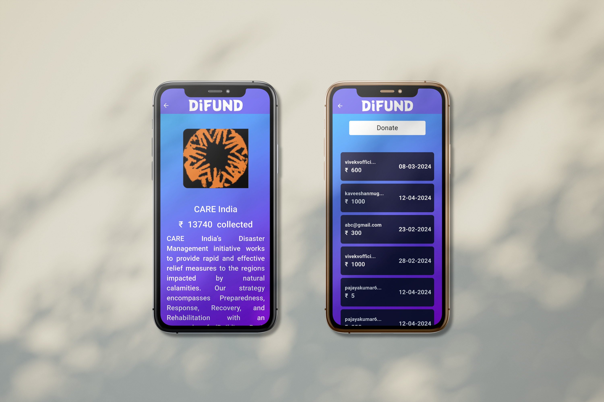
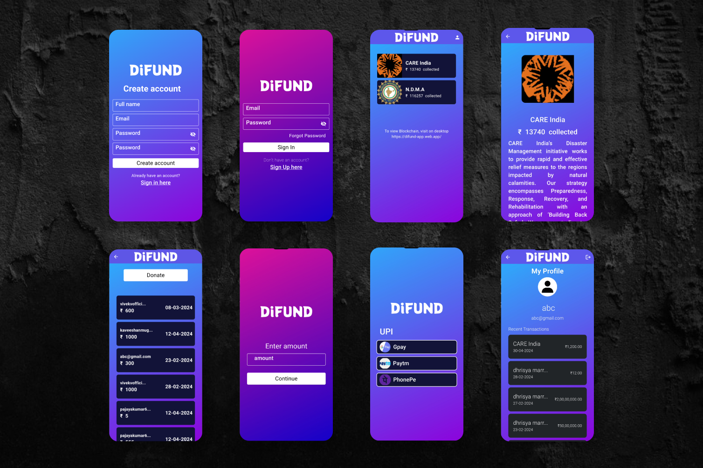

# DiFund

DiFund is an Android application on a mission to transform disaster relief by harnessing the power of blockchain technology. This innovative approach tackles the long-standing issue of opacity in traditional disaster fund management systems. DiFund utilizes a secure, public ledger powered by blockchain to record every single transaction involving disaster funds. It creates a transparent and tamper-proof record accessible to anyone with an internet connection. By enabling users to verify how funds are utilized, DiFund fosters trust and accountability within the entire disaster relief ecosystem.

## Installation

1. Clone the repository: `git clone https://github.com/dhrisyapn/difund.git`

2. Open the project in your preferred development environment (e.g., Android Studio, Visual Studio Code).

3. Build and run the app on your preferred device or emulator.

## Contributing

Contributions are welcome! If you find any issues or want to add new features to the app, feel free to submit a pull request. Please make sure to follow the project's code style and guidelines.

## License

This project is licensed under the [MIT License](LICENSE.md).
